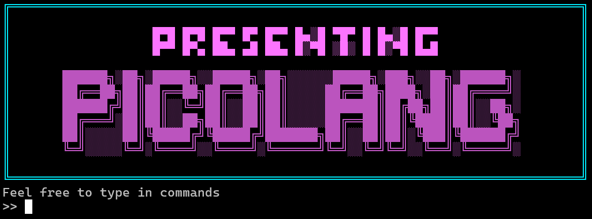

# PicoLang



[](https://github.com/HemanthBangera/PicoLang)
[](https://github.com/HemanthBangera/PicoLang)
[](LICENSE)
[](https://github.com/HemanthBangera/PicoLang)
[](https://github.com/HemanthBangera/PicoLang/pulls)

PicoLang is a tree-walk interpreter implemented in Go, designed to execute a custom dynamically-typed programming language. It provides a complete implementation of the lexical analysis, parsing, abstract syntax tree (AST) construction, and evaluation pipeline, following the design principles from Thorsten Ball’s “Writing an Interpreter in Go”. The interpreter supports first-class functions, lexical scoping, closures, arrays, hash literals, conditionals, and return statements, all managed through a custom object system and environment model.

## Features

- **Full Interpreter Pipeline:** Source Code → Lexer → Parser → AST → Evaluator  
- **Expressions & Statements:** Let bindings, function calls, return statements, conditionals, infix & prefix operators  
- **Data Types:** Integers, Booleans, Strings, Arrays, and Hash Maps  
- **Functions & Closures:** First-class functions with lexical scoping  
- **Built-in Functions:** `len`, `first`, `last`, `rest`, `push`  
- **Error Handling:** Parser and runtime error propagation  
- **REPL Support:** Interactive shell for executing PicoLang code 

## Implementation Details

### The Lexer
The **Lexer** (tokenizer) reads the source code character by character and converts it into a stream of **tokens** — the smallest meaningful units like identifiers, numbers, operators, or keywords.

**Key Components:**
- `NextToken()`: Returns the next token in the input stream  
- Handles identifiers, literals, and symbols (`=`, `==`, `+`, `-`, `!`, etc.)
- Skips whitespace and manages end-of-file detection  

**Example:**
```go
let five = 5;
let ten = 10;
```
*Generates tokens:*
```go
LET IDENT(five) = INT(5) ;
LET IDENT(ten) = INT(10) ;
```

###  The Parser
The Parser consumes the token stream from the lexer and builds an Abstract Syntax Tree (AST) that represents the structure of the code.
It uses a Pratt parser (top-down operator precedence parsing) to handle operator binding power elegantly.

**Key Components:**
- `ParseProgram()`: Entry point for building the AST
- `parseExpression()`: Parses prefix/infix expressions recursively
- `parseLetStatement(), parseReturnStatement()`: Handle statements
- The parser defines multiple dedicated functions, each responsible for parsing specific syntactic constructs of the language.
  
**Structure:**
```go
let add = fn(x, y) { x + y; };
add(5, 10);
```
*Produces an AST resembling:*
```go
Program
 ├── LetStatement (name=add)
 │    └── FunctionLiteral
 │         ├── Parameters: x, y
 │         └── Body: InfixExpression(+)
 └── CallExpression (function=add, arguments=[5,10])
```

### Evaluator
The Evaluator walks the AST and executes it directly.
It applies each node’s semantics using recursive evaluation.

**Implemented Builtins:**
- `mini_cd()`: Directory navigation with error handling
- `mini_echo()`: Text output with flag support
- `mini_env()`: Environment variable display
- `mini_exit()`: Shell termination with exit codes
- `mini_export()`: Environment variable creation/modification
- `mini_pwd()`: Current directory display
- `mini_unset()`: Environment variable removal
**Implementation: Each builtin is registered during command initialization and executed directly within the shell process, avoiding fork/exec overhead.**

### Executor
The executor manages command execution, handling both built-in commands and external programs through process creation and management.

**Key Components:**
- `Eval(node ast.Node, env *object.Environment)`: Central evaluator
- Handles: Literals (5, true, "hello"), Prefix/Infix operations (-5, a + b),If/Else conditionals,Function calls and returns, Built-in functions

```go
let x = 10;
let y = 5;
x + y * 2;
```
→ 20

### Environment
The Environment is the runtime symbol table — it maps variable names to values.
Every scope (global or function) has its own environment, allowing lexical scoping and closures.

**Key Components:**
- Implemented as a map[string]object.Object
- Supports nested (enclosed) environments
- When a function is called, a new environment is created and linked to its parent

```go
let newAdder = fn(x) { fn(y) { x + y }; };
let addTwo = newAdder(2);
addTwo(3);  // => 5
```

###  Object System
The object system defines the runtime types used by the evaluator.
Every evaluated value (integer, boolean, string, function, etc.) implements the object.Object interface.

**Core Types:**
- `Integer`, `Boolean`, `String`
- `Array`, `Hash`
- `Function` (user-defined functions)
- `Builtin` (native Go functions)
- `ReturnValue` (handles return inside functions)
- `Error` (runtime exceptions)

### Built-in Functions
PicoLang includes several built-in functions for convenience:

| Function | Description | Example |
| --- | --- | --- |
| `len()` | Returns length of string/array | `len("hello") → 5` |
| `first()` | Returns first element of array | `first([1,2,3]) → 1` |
| `last()` | Returns last element | `last([1,2,3]) → 3` |
| `rest()` | Returns array excluding first element | `rest([1,2,3]) → [2,3]` |
| `push()` | Adds element to end of array | `push([1,2], 3) → [1,2,3]` |


### The REPL
The REPL (Read–Eval–Print Loop) provides an interactive interface to test PicoLang code.
It continuously:
   1. Reads input
   2. Lexes, parses and evaluates
   3. Prints results
Example
```bash
$ go run main.go
>> let x = 10;
>> x * 2;
20
>> fn(x) { x + 1; }(4)
5
```
**Example PicoLang programs:**
```go
let factorial = fn(n) {
    if (n == 0) {
        return 1;
    } else {
        return n * factorial(n - 1);
    }
};
factorial(5); // => 120

let arr = [1, 2, 3];
push(arr, 4); // => [1,2,3,4]
len(arr);     // => 3

let user = {"name": "Hemanth", "lang": "Go"};
user["name"]; // => "Hemanth"
```
### Quick Start

#### Prerequisites
- Go (v1.20+)
- Unix-like OS (Linux/macOS/WSL)

#### Installation
```bash
# Clone the repository
git clone https://github.com/HemanthBangera/PicoLang.git

# Navigate to project directory
cd PicoLang

# Run the interpreter
go run main.go
```

### Future improvements
- Add while and for loops
- Implement modules/imports
- Expand built-in functions
- Improve error recovery in parser
- Add unit test coverage
- Compile to bytecode (next phase: Writing a Compiler in Go)
 error recovery

### Acknowledgements
- Thorsten Ball - for the incredible book
  
---
<p align="center">
  ⭐ <b>If you have made this far, please consider starring the repo!</b> ⭐
</p>

<p align="center">
  Made with ❤️ by <b>Hemanth</b>
</p>
